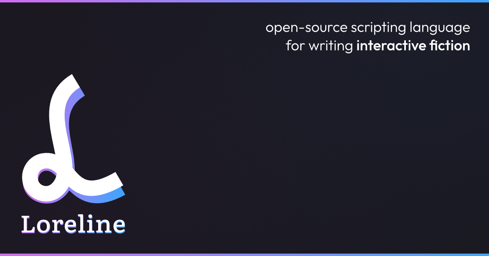

A modern and open-source scripting language for writing **interactive fiction**.

Designed so writers can focus on story and dialogue while still having real programming tools (branching, state, functions) when they need them. If you write for games, visual novels, or any kind of branching narrative, this is for you.

Loreline works everywhere: game engines, web apps, or standalone projects. It adapts to your tools, the stories you write stay portable.

### Get started

The documentation and an interactive playground are available on **[loreline.app](https://loreline.app)**.

## Building Loreline

What follows is only needed if you want to modify Loreline from source. If you just want to use Loreline with your favourite engine, check out [the integrations guides](https://loreline.app/en/docs/).

### Prerequisites

Building Loreline from source requires [Node.js](https://nodejs.org/) (v18+).
The resulting outputs (JS library, C# library, native CLI) have no Node.js dependency.

```sh
npm install    # Install Node.js dependencies (esbuild, tsx, etc.)
```

### Building

```sh
node ./setup --js          # Build JavaScript library (js/loreline.js)
node ./setup --cs          # Export C# source files (cs/Loreline/)
node ./setup --cs --cs-dll # Export C# + build Loreline.dll
node ./setup --py          # Build Python package (py/loreline/)
node ./setup --lua         # Build Lua module (lua/loreline/)
node ./setup --cpp         # Build native CLI (loreline / loreline.exe)
node ./setup --cpp-lib     # Build C++ shared library
```

### Setting up samples

```sh
node ./setup --sample          # Set up all sample projects
node ./setup --sample web      # Set up loreline-web only
node ./setup --sample unity    # Set up loreline-unity only
node ./setup --sample cpp      # Set up loreline-cpp only
node ./setup --sample python   # Set up loreline-python only
node ./setup --sample lua      # Set up loreline-lua only
```

This copies the built runtime and story files into the sample directories.
For loreline-web, run `--js` first. For loreline-unity, run `--cs` first.
For loreline-cpp, run `--cpp` first. For loreline-python, run `--py` first.
For loreline-lua, run `--lua` first.

### Testing

Python, Lua, and JS tests require running the corresponding build step first (e.g. `node ./setup --py` before Python tests).

```sh
node run test ./test                    # Run Neko tests only
python3 py/test-runner.py ./test        # Run Python tests only
lua5.4 lua/test-runner.lua ./test       # Run Lua tests only
npx tsx js/test-runner.ts ./test        # Run JS tests only
node ./setup --test                     # Build and run all test suites (Neko + C# + C# AOT + JS + C++ lib + Python + Lua)
```

## License

MIT License

Copyright (c) 2025-2026 Jérémy Faivre

Permission is hereby granted, free of charge, to any person obtaining a copy
of this software and associated documentation files (the "Software"), to deal
in the Software without restriction, including without limitation the rights
to use, copy, modify, merge, publish, distribute, sublicense, and/or sell
copies of the Software, and to permit persons to whom the Software is
furnished to do so, subject to the following conditions:

The above copyright notice and this permission notice shall be included in all
copies or substantial portions of the Software.

THE SOFTWARE IS PROVIDED "AS IS", WITHOUT WARRANTY OF ANY KIND, EXPRESS OR
IMPLIED, INCLUDING BUT NOT LIMITED TO THE WARRANTIES OF MERCHANTABILITY,
FITNESS FOR A PARTICULAR PURPOSE AND NONINFRINGEMENT. IN NO EVENT SHALL THE
AUTHORS OR COPYRIGHT HOLDERS BE LIABLE FOR ANY CLAIM, DAMAGES OR OTHER
LIABILITY, WHETHER IN AN ACTION OF CONTRACT, TORT OR OTHERWISE, ARISING FROM,
OUT OF OR IN CONNECTION WITH THE SOFTWARE OR THE USE OR OTHER DEALINGS IN THE
SOFTWARE.
